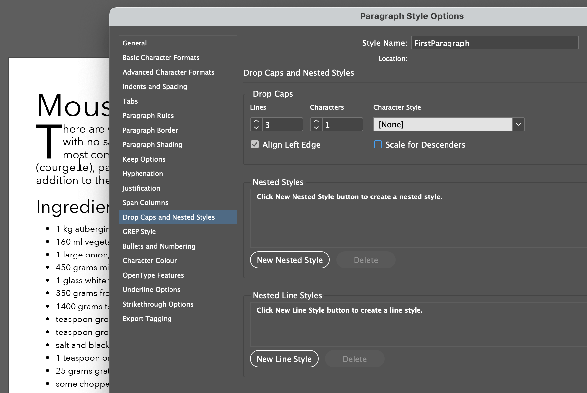

A drop cap is so called because the first character drops down below the line in which it would normally be restricted. The amount of drop can vary but is usually defined by the number of lines. The illustration here shows a **drop** of 3 lines.

The way that the words to the right of this single character wrap or are offset is an important consideration and how this adjustment is made will depend on the platform (web or print). It also is worth considering which word will start the paragraph too, because starting with the letter **I** may look odd and confuse the reader.


## How do we achieve drop caps for print?

As you may expect, I am going to talk about *InDesign* here.

To add drop caps to a paragraph we use the Drop Caps and Nested Styles feature. Here we see this in use:



### Further adjustments

As you see from above illustration the character is in the same style as the paragraph; in this case *Avenir Next*. It may be desirable sometimes to use a different typeface for this single character, and we can do this by creating a **character** style for this purpose.


### Add a block behind

Unfortunately, InDesign does not provide a direct way to provide character shading so you need to achieve this by setting the paragraph to have the shading but create offsets right and bottom to coincide with that first character.


You also need to adjust the first line indent and the tracking on that character style to get a good spacing.

## How do we achieve drop caps for the web?

This (be not surprised) is a little more complicated; there also more than one way!

### The best way (without adding extra content to the HTML markup)

It is possible to target the first letter of the paragraph like this:

```css
.blurb:first-letter {
  background-color: rgb(61, 60, 145);
  color: white;
  float: left;
  font-family: Georgia;
  font-size: 4em;
  line-height: 1;
  padding: 0 .1em;
  margin: .1em;
}
```

Here is what this could look like:

